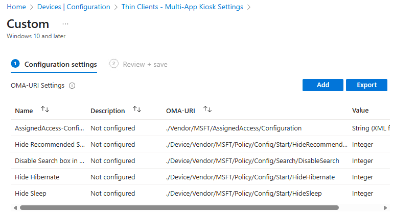

# Windows App Kiosk - Intune Deployment

**Navigation:** [Overview](README.md) | [Solution Overview](SOLUTION_OVERVIEW.md) | [Implementation Guide](IMPLEMENTATION.md) | Intune Deployment | [Advanced Customizations](ADVANCED_CUSTOMIZATIONS.md)

---

## Table of Contents

- [Windows App Kiosk - Intune Deployment](#windows-app-kiosk---intune-deployment)
  - [Table of Contents](#table-of-contents)
  - [Win32 App Deployment](#win32-app-deployment)
    - [Recommended Intune Command Lines](#recommended-intune-command-lines)
    - [Detection Method](#detection-method)
  - [Configuration Profiles Approach](#configuration-profiles-approach)
    - [Shell Launcher Settings](#shell-launcher-settings)
    - [MultiApp Kiosk](#multiapp-kiosk)
    - [AutoLogon Settings](#autologon-settings)
    - [Common Settings](#common-settings)
    - [Additional Configuration Settings](#additional-configuration-settings)
      - [Smart Card Settings](#smart-card-settings)
      - [Idle Lock Timeout](#idle-lock-timeout)
      - [Automatic Maintenance](#automatic-maintenance)
      - [Power Management](#power-management)
  - [Additional Resources](#additional-resources)

## Win32 App Deployment

You can deploy this solution to multiple devices using [Microsoft Intune Win32 apps](https://learn.microsoft.com/en-us/mem/intune/apps/apps-win32-app-management).

### Recommended Intune Command Lines

**For Standard Deployments:**

``` cmd
powershell.exe -ExecutionPolicy Bypass -File Set-WindowsAppKioskSettings.ps1 -ShowSettings
```

*Use this for most corporate environments where users sign in with their own credentials*

**For Dedicated Kiosk Devices:**

``` cmd
powershell.exe -ExecutionPolicy Bypass -File Set-WindowsAppKioskSettings.ps1 -AutoLogonKiosk -WindowsAppAutoLogoffConfig "ResetAppOnCloseOrIdle" -WindowsAppAutoLogoffTimeInterval 15
```

*Perfect for lobby kiosks, conference rooms, or shared access points*

**For New Device Deployments:**

``` cmd
powershell.exe -ExecutionPolicy Bypass -File Set-WindowsAppKioskSettings.ps1 -InstallWindowsApp -SharedPC -ShowSettings
```

*Automatically installs Windows App and configures shared PC features*

### Detection Method

You can utilize a custom detection script in Intune or use a Registry detection method to read the value of `HKEY_LOCAL_MACHINE\Software\Kiosk\version` which should be equal to the value of the version parameter used in the deployment script.

## Configuration Profiles Approach

As an alternative to Win32 app deployment, you can use a mixture of Intune configuration profiles to deploy the kiosk settings.

> **Important Limitations:**
> 
> - **Idle Timeout Behaviors**: The idle lock → logoff → sleep escalation behavior is **not available** when using configuration profiles only. This feature requires a custom scheduled task that is created by the [Set-WindowsAppKioskSettings.ps1](Set-WindowsAppKioskSettings.ps1) script during Win32 app deployment. If you need this functionality, use the Win32 app deployment method instead.
> 
> - **Administrator Exclusions**: When deploying user-scoped policies (marked with "User" in the settings path), ensure these policies are deployed to **standard users only** and specifically **exclude administrators**. This ensures help desk and support personnel can troubleshoot and perform administrative tasks on kiosk devices without being restricted by the kiosk policies. Use device filters or group assignments to properly scope these policies.

### Shell Launcher Settings

1. **Shell Launcher** - Create a custom configuration profile:
   - Specify the **OMA-URI** as `./Vendor/MSFT/AssignedAccess/ShellLauncher` with the **Data type** as `string (XML file)`. Then select the appropriate ShellLauncher XML file from the `source\AssignedAccess\ShellLauncher` directory.
   - Deploy to devices. [^1]

   **Figure 1:** Intune Shell Launcher configuration

   

2. **Disable Task Manager in the lock screen** - Create a new Settings Catalog profile:
   - **Administrative Templates | System > Ctrl+Alt+Del Options | Remove Task Manager (User)**: Set to `Enabled`.
   - Deploy to <u>standard</ul> users and use a kiosk devices device filter.

3. **Hide and Restrict Drives** - Create a Settings Catalog profile:
   - **Administrative Templates | Windows Components > File Explorer | Prevent access to drives from My Computer (User)**: Set to `Enabled` with value `Restrict all drives`
   - Deploy to <u>standard</u> users with Kiosk Devices filter

4. **Disable Privacy Experience** (if not using Shared PC) - Create a Settings Catalog profile:
   - **Administrative Templates | Windows Components > OOBE | Don't launch privacy settings experience on user logon**: Set to `Enabled`
   - Deploy to Devices

### MultiApp Kiosk

1. **Multi-App Configuration** - Create a custom configuration profile:
   - Add a new OMA-URI Setting and specify the **OMA-URI** as `./Vendor/MSFT/AssignedAccess/Configuration` with the **Data type** as `string (XML file)`.
   - Select the appropriate MultiApp XML file from the `source\AssignedAccess\MultiApp` directory. [^2]

   **Figure 2:** Intune Multi-App Kiosk configuration

   

2. **Hide Start Menu Elements** - In the same custom configuration profile, add the following OMA-URI settings:
   - **Hide Recommended Section**: OMA-URI `./Device/Vendor/MSFT/Policy/Config/Start/HideRecommendedSection`, Data type: `Integer`, Value: `1`
   - **Disable Search Box**: OMA-URI `./Device/Vendor/MSFT/Policy/Config/Search/SearchboxTaskbarMode`, Data type: `Integer`, Value: `0`
   - **Hide Hibernate**: OMA-URI `./Device/Vendor/MSFT/Policy/Config/Start/HideHibernate`, Data type: `Integer`, Value: `1`
   - **Hide Sleep**: OMA-URI `./Device/Vendor/MSFT/Policy/Config/Start/HideSleep`, Data type: `Integer`, Value: `1`
   - Deploy to Devices

   **Figure 3:** Intune Custom Profile configuration

   

3. **Restrict Settings and Control Panel** (Optional) - Create a Settings Catalog profile:
   - **Control Panel | Settings Page Visibility (User)**: Set to `showonly:about;display;sound`
   - **Control Panel | Restrict Control Panel to specific pages (User)**: Set to `Enabled`
   - **Control Panel | List of Control Panel pages that users may see (User)**: Set to `Microsoft.Sound;Microsoft.Display;Microsoft.About`
   - Deploy to <u>standard</u> users with Kiosk Devices filter

   **Figure 4:** Intune Restrict Settings and Control Panel

   

4. **Hide Windows Security Control** - Create a Settings Catalog profile:
   - **Administrative Templates | Windows Components > Windows Security > Systray | Hide Windows Security Systray**: Set to `Enabled`
   - Deploy to Devices

### AutoLogon Settings

If you selected an autologon Multi-App or Shell Launcher Profile, configure Windows App automatic logoff behavior:

1. **Windows App Autologoff** - Configure using one of these methods:
   - Use [Deploy-WindowsApp.ps1](Apps/WindowsApp/Deploy-WindowsApp.ps1) to deploy Windows App as a Win32 App and configure the parameters.
   - Create an Intune remediation script to set the registry values
   - For detailed configuration options, see [Windows App Automatic Logoff](https://learn.microsoft.com/en-us/windows-app/windowsautologoff)
   - For information on creating remediation scripts, see [Use Intune remediations](https://learn.microsoft.com/en-us/mem/intune/fundamentals/remediations)

2. **Remove Change Password, Lock, and Logoff, and disable screen saver password protection** - Create a Settings Catalog profile:
   - **Administrative Templates | System > Ctrl+Alt+Del Options | Remove Change Password (User)**: Set to `Enabled`
   - **Administrative Templates | System > Ctrl+Alt+Del Options | Remove Lock Computer (User)**: Set to `Enabled`
   - **Administrative Templates | System > Logon | Hide entry points for Fast User Switching**: Set to `Enabled`
   - **Administrative Templates | Start Menu and Taskbar | Remove Logoff on the Start Menu (User)**: Set to `Enabled` (Shell Launcher only)
   - **Administrative Templates | Control Panel > Personalization | Password protect the screen saver (User)**: Set to `Disabled`
   - Deploy user settings to <u>standard</u> users with Kiosk Devices filter

3. **Disable Fast User Switching** - Create a Settings Catalog profile:
   - **Administrative Templates | System > Logon | Hide entry points for Fast User Switching**: Set to `Enabled`
   - Deploy to Devices

### Common Settings

These settings apply to both Shell Launcher and MultiApp Kiosk configurations:

1. **Shared PC Configuration** (Optional) - Create a Shared multi-user device configuration profile:
   - Select the appropriate settings based on your desired configuration
   - The figure below shows all items configured. For more information about Shared PC settings see the [Shared PC Technical Reference](https://learn.microsoft.com/en-us/windows/configuration/shared-pc/shared-pc-technical)
   - Deploy to Devices

   **Figure 5:** Intune Shared Multi-User Device Configuration

   

2. **Disable Windows Spotlight** - Create a Settings Catalog profile:
   - **Experience | Allow Windows Spotlight (User)**: Set to `Block`
   - Deploy to <u>standard</u> users with Kiosk Devices filter

3. **Disable First Logon Animation** (if not using Shared PC) - Create a Settings Catalog profile:
   - **Windows Logon | Enable First Logon Animation**: Set to `Disabled`
   - Deploy to Devices

### Additional Configuration Settings

The following settings can be applied via Settings Catalog profiles to replicate the Local Group Policy configurations used in the manual deployment script:

#### Smart Card Settings

If using Smart Card authentication without AutoLogon, complete either of the following based on your requirements:

1. **Lock Workstation on Smart Card Removal** - Create a Settings Catalog profile:
   - **Administrative Templates | Windows Components > Smart Card | Interactive Logon Smart card removal behavior**: Set to `Lock Workstation`
   - Deploy to Devices

2. **Force Logoff on Smart Card Removal** - Create a Settings Catalog profile:
   - **Administrative Templates | Windows Components > Smart Card | Interactive Logon Smart card removal behavior**: Set to `Force Logoff`
   - Deploy to Devices

#### Idle Lock Timeout

If using idle lock timeout without AutoLogon:

1. **Machine Inactivity Limit** - Create a Settings Catalog profile:
   - **Administrative Templates | Windows Components > Windows Logon Options | Machine Inactivity Limit**: Set to `Enabled` with timeout in seconds (e.g., 900 for 15 minutes)
   - Deploy to Devices

#### Automatic Maintenance

> **Important:** If you supplied a Maintenance Start Time with the **Shared PC** profile (step 1 in Common Settings), automatic maintenance settings are already managed by that profile. Only configure these settings separately if you did **not** configure the Maintenance Start Time using the Shared PC profile. Configuring both may cause conflicts. For more information, see [Set up a shared or guest PC with Windows](https://learn.microsoft.com/en-us/windows/configuration/shared-pc/).

If enabling automatic maintenance without Shared PC:

1. **Configure Automatic Maintenance** - Create a Settings Catalog profile:
   - **Administrative Templates | Windows Components > Maintenance Scheduler | Automatic Maintenance Activation Boundary**: Set to time in ISO 8601 format (e.g., `2000-01-01T02:00:00`)
   - **Administrative Templates | Windows Components > Maintenance Scheduler | Automatic Maintenance WakeUp Policy**: Set to `Enabled`
   - **Administrative Templates | Windows Components > Maintenance Scheduler | Automatic Maintenance Random Delay**: Set to `Enabled` with random delay (e.g., `PT2H` for 2 hours)
   - Deploy to Devices

#### Power Management

> **Important:** If you enabled the Power Policies setting of the **Shared PC** profile (step 1 in Common Settings), power management settings (sleep timeouts, hibernate) are already managed by that profile. Only configure these settings separately if you did **not** enable Power Policies via the Shared PC profile. Configuring both may cause conflicts. For more information, see [Set up a shared or guest PC with Windows](https://learn.microsoft.com/en-us/windows/configuration/shared-pc/).

If configuring power management without Shared PC:

1. **Power Settings** - Create a Settings Catalog profile:
   - **Administrative Templates | System > Power Management > Sleep Settings | Specify the system sleep timeout (on battery)**: Set to timeout in seconds
   - **Administrative Templates | System > Power Management > Sleep Settings | Specify the system sleep timeout (plugged in)**: Set to timeout in seconds
   - **Administrative Templates | System > Power Management > Sleep Settings | Require a password when a computer wakes (on battery)**: Set to `Disabled`
   - **Administrative Templates | System > Power Management > Sleep Settings | Require a password when a computer wakes (plugged in)**: Set to `Disabled`
   - **Administrative Templates | System > Power Management > Sleep Settings | Turn on standby states (S1-S3) when sleeping (on battery)**: Set to `Enabled`
   - **Administrative Templates | System > Power Management > Sleep Settings | Turn on standby states (S1-S3) when sleeping (plugged in)**: Set to `Enabled`
   - **Administrative Templates | System > Power Management > Sleep Settings | Allow hybrid sleep (on battery)**: Set to `Disabled`
   - **Administrative Templates | System > Power Management > Sleep Settings | Allow hybrid sleep (plugged in)**: Set to `Disabled`
   - **Administrative Templates | System > Power Management > Button Settings | Select the Power button action (on battery)**: Set to `Sleep`
   - **Administrative Templates | System > Power Management > Button Settings | Select the Power button action (plugged in)**: Set to `Sleep`
   - **Administrative Templates | System > Power Management > Button Settings | Select the Sleep button action (on battery)**: Set to `Sleep`
   - **Administrative Templates | System > Power Management > Button Settings | Select the Sleep button action (plugged in)**: Set to `Sleep`
   - **Administrative Templates | System > Power Management > Button Settings | Select the lid switch action (on battery)**: Set to `Sleep`
   - **Administrative Templates | System > Power Management > Button Settings | Select the lid switch action (plugged in)**: Set to `Sleep`
   - **Administrative Templates | System > Power Management > Energy Saver Settings | Energy Saver Battery Threshold (on battery)**: Set to `Enabled` with `70%`
   - **Administrative Templates | System > Power Management | Turn Off Hibernate**: Set to `Enabled`
   - Deploy to Devices
  
## Additional Resources

- [Intune Win32 App Management](https://learn.microsoft.com/en-us/mem/intune/apps/apps-win32-app-management)
- [Intune Configuration Profiles](https://learn.microsoft.com/en-us/mem/intune/configuration/device-profiles)
- [OMA-URI Settings](https://learn.microsoft.com/en-us/mem/intune/configuration/custom-settings-windows-10)
- [Intune Settings Catalog](https://learn.microsoft.com/en-us/mem/intune/configuration/settings-catalog)

[^1]: For more information see [Configure a Kiosk section of the Shell Launcher reference](https://learn.microsoft.com/en-us/windows/configuration/shell-launcher/quickstart-kiosk?tabs=csp)
[^2]: For more information see [Configure a restricted user experience (multi-app kiosk) with Assigned Access](https://learn.microsoft.com/en-us/windows/configuration/assigned-access/configure-multi-app-kiosk?tabs=intune)
